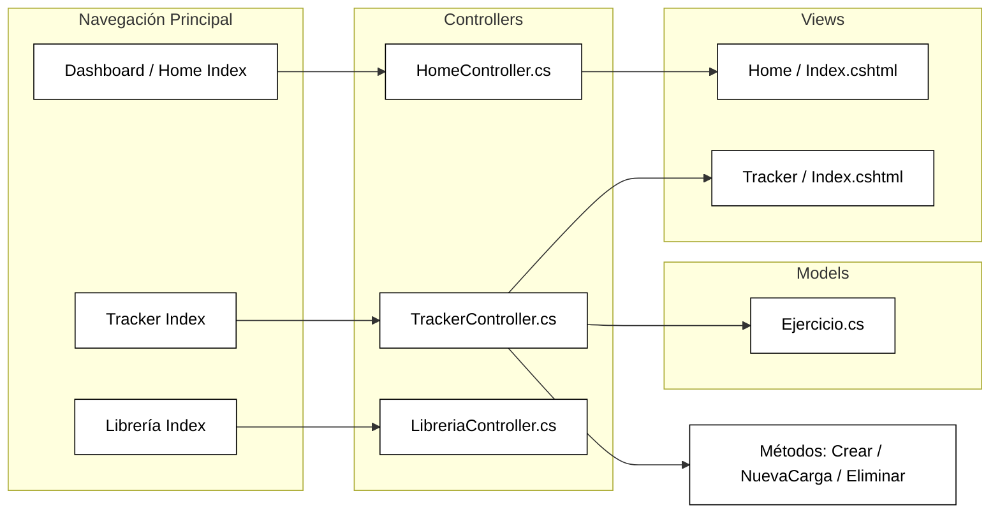

# ADR-01: Overload

| Campo | Valor |
| :--- | :--- |
| **Autor** | Josué Enmanuel Poot Mateo |
| **Fecha** | 15/05/2026 |
| **Estado** | Propuesto |

---

## Contexto

Lo que se busca construir es una herramienta que ayude a las personas que tienen un perfil interesado en el deporte y la actividad física. 

La problemática se centra en la premisa de **cómo estructurar un entrenamiento óptimo y cómo llevar un control de este**. 

### Condiciones y restricciones de decisión:
* Una página donde se pueda llevar un monitoreo de los entrenamientos de la semana.
* Un control de elementos como lista de ejercicios, recomendaciones, imágenes y satisfacción del ejercicio.
* Un diseño atractivo a la vista, basado en el tema en el que tomamos punto (modo oscuro).
* Implementar las tecnologías de .NET (C#, HTML, CSS).

---

## Decisión

Elegí una app de entrenamiento que se llamará **Overload**, la cual será de ayuda para el público al cual buscamos llegar. 

Las tecnologías involucradas en este proyecto serán las de Microsoft, como el framework **ASP.NET Core MVC (Model-View-Controller)**, que nos ayudará a poder tener una base sólida de lo que será el inicio del proyecto.

---

## Consecuencias y Compensaciones

### Lo que gano 
* **Resolución de una problemática práctica:** Primero que nada, siento que lo que hago es más enfocado a la parte de utilidades, por lo que gano algo que resuelva una problemática real.
* **Alineación con la comunidad:** En mi caso, soy una persona que entrena y hace bastante actividad física, por lo que, como parte de la comunidad que hace lo mismo, considero que esto realmente ayudará a las personas como yo a tener entrenamientos más efectivos y buenos a la larga.

### Lo que sacrifico o asumo 
Considero que de las cosas más complicadas y que suponen un reto técnico es:
1. **Expansión del catálogo:** Expandir constantemente el catálogo de ejercicios.
2. **Monitoreo dinámico:** Crear un método para que haya una revisión constante sobre los entrenamientos.
3. **Complejidad algorítmica:** Implementar correctamente la lógica para poder hacer la sobrecarga progresiva u otros métodos que pienso implementar (como calculadora de metabolismo basal, consejos, entre otros).
4. **Riesgo de sesgo:** El riesgo sería caer en sesgo, ya que usaré información que mayormente debe proporcionarse por una persona experimentada en el tema.
5. **Dificultad de integración externa:** Una de las cosas que podrían dificultarse es implementar un catálogo de alimentos usando una API externa como la que utiliza Fitia o algo parecido.

---

## Diagrama de Estructura del Sistema

A continuación se muestra el boceto de cómo se estructura la navegación, los controladores, los modelos y las vistas de la aplicación:

