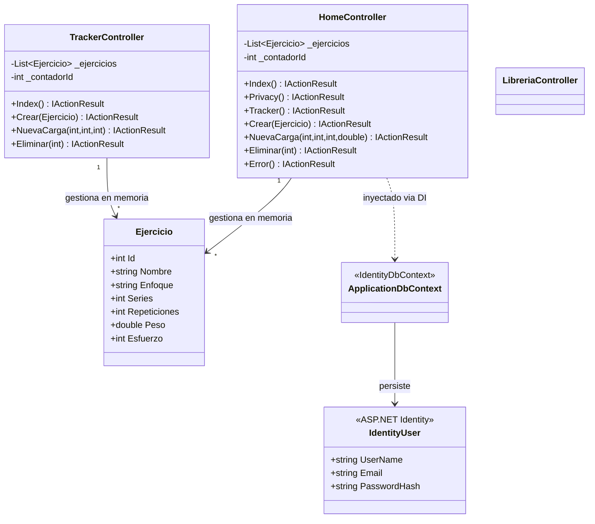

# ADR-02: Vistas Arquitectónicas del Sistema OverLoad

| Campo | Valor |
| :--- | :--- |
| **Autor** | Josué Enmanuel Poot Mateo |
| **Fecha** | 05/06/2026 |
| **Estado** | Propuesto |

---

## Contexto

A medida que el proyecto **OverLoad** crece, se hace necesario documentar su arquitectura desde diferentes perspectivas para facilitar la comprensión del sistema tanto para el desarrollador como para cualquier colaborador futuro.

Se utiliza el modelo de **4 vistas arquitectónicas** para describir el sistema desde los ángulos que más interesan a cada tipo de stakeholder:

| Vista | Enfocada en | Audiencia |
| :--- | :--- | :--- |
| Lógica | Clases, módulos y responsabilidades | Desarrolladores |
| Física | Nodos de hardware y artefactos de software | Operaciones / DevOps |
| Despliegue | Capas y flujo de comunicación | Desarrolladores / Ops |
| Procesos | Flujos en tiempo de ejecución | Desarrolladores / QA |

---

## Decisión

Se documentan las cuatro vistas arquitectónicas del sistema usando diagramas **Mermaid**, los cuales se renderizan directamente en GitHub sin herramientas externas.

Cada vista refleja el estado actual del proyecto: una aplicación **ASP.NET Core MVC** con autenticación via **ASP.NET Identity**, persistencia en **SQLite** mediante **Entity Framework Core**, y almacenamiento temporal en memoria para los ejercicios del tracker.

---

## Consecuencias

* La documentación queda versionada junto con el código fuente.
* Los diagramas Mermaid son modificables en texto plano y no requieren exportar imágenes.
* Al evolucionar el sistema (e.g., migrar de lista en memoria a base de datos real), los diagramas deben actualizarse para mantener consistencia.

---

## Vista Lógica

Muestra las clases principales del sistema, sus responsabilidades y relaciones. El patrón MVC divide el sistema en tres capas: **Controladores** (lógica de solicitudes), **Modelos** (datos del dominio) y **Vistas** (presentación HTML).

---
