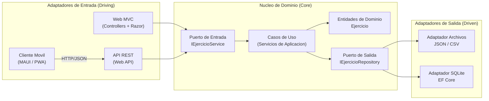

# ADR-03: Adopción de Arquitectura Hexagonal en OverLoad

| Campo  | Valor |
|--------|-------|
| Autor  | Josué Enmanuel Poot Mateo |
| Fecha  | 12/06/2026 |
| Estado | `Propuesto` |

---

## Contexto

**OverLoad** es una aplicación para registrar y dar seguimiento a entrenamientos de fuerza (ejercicios, series, repeticiones, peso y esfuerzo). Hoy está construida como una aplicación **ASP.NET Core MVC** con autenticación vía **ASP.NET Identity**, persistencia en **SQLite** mediante **Entity Framework Core**, y almacenamiento temporal de los ejercicios en una **lista en memoria** dentro de los controladores (ver ADR-02).

El problema es que la lógica del dominio (cómo se crea un ejercicio, cómo se calcula la carga, qué reglas aplican) está **mezclada dentro de los controladores y atada a la web y a EF Core**. Esto bloquea dos objetivos que quiero para el proyecto:

1. **Desplegar la app en distintos canales**: además del sitio web, quiero poder consumir la misma lógica desde un **cliente móvil** (app nativa o PWA) sin reescribir las reglas.
2. **Manejar los datos con flexibilidad**: quiero poder guardar los ejercicios en **archivos** (JSON/CSV) o en **base de datos** de forma intercambiable, sin que el cambio afecte a la lógica de negocio.

Condiciones y restricciones que influyeron en la decisión:

- Es un proyecto académico/personal con un solo desarrollador, por lo que la arquitectura no puede ser tan pesada que frene el avance.
- Ya conozco **C#, ASP.NET Core, EF Core e Inyección de Dependencias (DI)**, que son la base para implementar puertos y adaptadores.
- En clase se revisaron estilos arquitectónicos y vistas (modelo 4+1), lo que me dio el marco para razonar la separación por capas.
- El tiempo disponible es limitado, así que se busca una arquitectura que se pueda introducir de forma incremental sobre el código actual.

---

## Decisión

Adoptar la **Arquitectura Hexagonal (Puertos y Adaptadores)**, reorganizando el sistema en tres anillos:

- **Núcleo de dominio (Core)**: contiene las entidades (`Ejercicio`) y la lógica de negocio en **servicios de aplicación** (casos de uso como "registrar ejercicio", "registrar nueva carga", "listar ejercicios", "eliminar"). El núcleo **no conoce** ASP.NET, EF Core ni el sistema de archivos.
- **Puertos**: interfaces definidas por el núcleo.
  - *Puerto de entrada* (driving): `IEjercicioService`, lo que el mundo exterior puede pedirle al sistema.
  - *Puerto de salida* (driven): `IEjercicioRepository`, lo que el sistema necesita del exterior para persistir datos.
- **Adaptadores**: implementaciones concretas que se conectan a los puertos mediante **DI**.
  - *Adaptadores de entrada*: una **API REST** (Web API) y los **controladores MVC** que invocan los casos de uso.
  - *Adaptadores de salida*: un **adaptador de archivos (JSON)** y un **adaptador SQLite/EF Core**, ambos implementando `IEjercicioRepository` e intercambiables por configuración.

Para el objetivo de múltiples canales, el núcleo expondrá una **API REST** que será consumida tanto por la **web (MVC)** como por un **futuro cliente móvil** (MAUI / React Native / PWA), todos como adaptadores de entrada sobre la misma lógica.

### ¿Por qué?

La característica clave de la arquitectura hexagonal que resuelve mi problema es la **inversión de dependencias hacia el dominio**: el núcleo define interfaces (puertos) y los detalles externos (web, móvil, archivos, base de datos) dependen de ellas, no al revés.

- Como la lógica de negocio queda aislada detrás del puerto `IEjercicioService`, **puedo agregar un nuevo canal (móvil) creando solo un adaptador de entrada nuevo**, sin tocar ni duplicar las reglas del dominio. Eso es exactamente lo que necesito para desplegar en web y móvil a la vez.
- Como la persistencia queda detrás del puerto `IEjercicioRepository`, **cambiar de archivos JSON a SQLite (o tener ambos)** es solo cuestión de registrar otro adaptador en la DI. Eso resuelve mi necesidad de manejar los datos como archivos con facilidad, sin reescribir la lógica.
- Reutilizo lo que ya sé (DI de ASP.NET Core) para "enchufar" los adaptadores, por lo que la decisión es realista con mi tiempo y experiencia.

### Alternativas consideradas

| Alternativa | Por qué la descarté |
|-------------|---------------------|
| Mantener MVC clásico con lógica en los controladores (estado actual) | La lógica queda atada a la web y a EF Core. Agregar un cliente móvil obligaría a duplicar reglas, y cambiar la persistencia a archivos implicaría tocar los controladores. No cumple mis dos objetivos. |
| Arquitectura en capas tradicional (Presentación → Negocio → Datos) | Separa responsabilidades, pero la capa de negocio normalmente sigue dependiendo "hacia abajo" de la capa de datos concreta. La intercambiabilidad de persistencia (archivo vs SQLite) y de canal (web vs móvil) queda menos garantizada que con puertos explícitos. |
| Microservicios | Sobredimensionado para un proyecto de un solo desarrollador. Añade complejidad de despliegue, red y operación que no necesito ahora y que frenaría el avance académico. |
| Clean Architecture / Onion completa | Comparte la idea de núcleo aislado, pero con más anillos y reglas formales. Para el tamaño de OverLoad, hexagonal me da el mismo beneficio (puertos/adaptadores) con menos ceremonia. |

---

## Consecuencias

**Lo que gano:**

- *Técnica*: añadir un nuevo canal de entrada (API REST para móvil) o cambiar el almacenamiento (de SQLite a archivos JSON o viceversa) se vuelve **localizado y de bajo riesgo**, porque solo implico un adaptador nuevo contra un puerto ya existente; el dominio no se modifica.
- *Técnica adicional*: la lógica de negocio queda **probable de forma aislada** (tests unitarios sobre los casos de uso con un repositorio en memoria simulado), sin necesidad de levantar la base de datos ni el servidor web.
- *Proceso / equipo*: el trabajo se organiza por **fronteras claras** (dominio, puertos, adaptadores). Esto facilita avanzar de forma incremental y, si en el futuro colabora alguien más, cada quien puede trabajar un adaptador sin pisar el núcleo.

**Lo que sacrifico o asumo:**

- *Limitación técnica*: aparece **más estructura desde el inicio** (interfaces, capa de aplicación, mapeo entre modelos del dominio y entidades de EF/DTOs). Para una funcionalidad muy simple, escribir el caso de uso, el puerto y el adaptador es más trabajo que un controlador directo.
- *Deuda o riesgo*: si el proyecto crece, deberé **mantener la disciplina de no filtrar detalles de infraestructura al núcleo** (por ejemplo, no usar tipos de EF Core dentro del dominio). Además, la migración del código actual (lógica dentro de los controladores) hacia este esquema debe hacerse de forma ordenada para no introducir regresiones, y queda pendiente definir el contrato de la API REST y la autenticación (Identity) como adaptador.

---

## Diagrama

Estructura del sistema bajo la arquitectura hexagonal: el núcleo en el centro, los puertos como fronteras y los adaptadores conectándose desde afuera.

