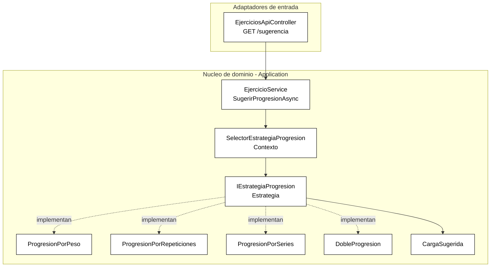

# ADR-04: Patrón Strategy para la progresión de carga

| Campo  | Valor |
|--------|-------|
| Autor  | Josué Enmanuel Poot Mateo |
| Fecha  | 26/06/2026 |
| Estado | `Aceptado` |

---

## Contexto

**OverLoad** ayuda a registrar entrenamientos de fuerza aplicando el principio de **sobrecarga progresiva**: para seguir progresando, la carga de cada ejercicio debe aumentar con el tiempo. Hasta ahora la app solo guardaba los valores que el usuario tecleaba (`ActualizarCargaAsync`), sin ofrecer ninguna recomendación sobre **cómo** progresar.

El problema es que "progresar" no es una sola fórmula: en la práctica del entrenamiento existen varias formas válidas y de uso común de aplicar sobrecarga sobre un mismo ejercicio:

- Subir el **peso** (orientado a fuerza).
- Subir las **repeticiones** (orientado a hipertrofia/resistencia).
- Agregar **series** (orientado a volumen).
- **Doble progresión** (subir reps hasta un tope y, al alcanzarlo, subir peso y reiniciar reps).

Quiero incorporar esta funcionalidad de sugerencia respetando la arquitectura ya adoptada (Hexagonal, ver ADR-03): la lógica debe vivir en el **núcleo de dominio**, ser fácil de extender con nuevas formas de progresión y poder consumirse desde cualquier adaptador de entrada (web MVC, API REST o un futuro cliente móvil).

Condiciones y restricciones que influyeron en la decisión:

- Es un proyecto académico/personal con un solo desarrollador; la solución debe ser simple de mantener.
- Se espera que el catálogo de progresiones **crezca** (más adelante podrían añadirse progresión por descanso, por tempo, etc.).
- Ya uso **C#, Inyección de Dependencias (DI)** y la separación en puertos/adaptadores, base ideal para enchufar algoritmos intercambiables.
- La selección de la progresión es un dato de entrada (lo elige el usuario), por lo que debe poder cambiarse **en tiempo de ejecución**, no de compilación.

---

## Decisión

Aplicar el patrón de comportamiento **Strategy (GoF)** para encapsular cada algoritmo de progresión de carga.

Se introduce en el núcleo (`Application/Progresion`):

- Una interfaz **`IEstrategiaProgresion`** (la *estrategia*) con el método `Sugerir(Ejercicio) -> CargaSugerida`, más una `Clave` y un `Nombre`.
- Cuatro implementaciones intercambiables: **`ProgresionPorPeso`**, **`ProgresionPorRepeticiones`**, **`ProgresionPorSeries`** y **`DobleProgresion`**.
- Un objeto de resultado **`CargaSugerida`** (record) que devuelve la carga propuesta y su justificación.
- Un **`SelectorEstrategiaProgresion`** (el *contexto*) que recibe por DI **todas** las estrategias registradas y resuelve la adecuada a partir de su clave.

El servicio de aplicación `EjercicioService` expone el caso de uso `SugerirProgresionAsync(id, estrategia)`, y se añade el adaptador de entrada REST `GET /api/v1/ejercicios/{id}/sugerencia?estrategia={clave}`.

### ¿Por qué?

La característica concreta que resuelve mi problema es que **Strategy define una familia de algoritmos intercambiables detrás de una interfaz común**, de modo que:

- El algoritmo de progresión se **selecciona en tiempo de ejecución** según lo que pida el usuario (la clave `peso`, `repeticiones`, `series` o `doble`).
- **Agregar una nueva progresión no obliga a modificar el código existente** (principio Open/Closed): basta crear una clase que implemente `IEstrategiaProgresion` y registrarla en DI; ni el `EjercicioService` ni el `SelectorEstrategiaProgresion` cambian.
- Se elimina el `switch`/`if-else` gigante que tendría toda la lógica de progresión mezclada en el servicio, reemplazándolo por polimorfismo.
- Cada algoritmo queda **aislado y probable** por separado, ya que las estrategias son clases puras del núcleo sin dependencias de ASP.NET ni EF Core.

### Alternativas consideradas

| Alternativa | Por qué la descarté |
|-------------|---------------------|
| **Bloque `switch`/`if-else` dentro de `EjercicioService`** | Concentra todas las reglas en un solo método; cada nueva progresión obliga a editar y reprobar ese método (rompe Open/Closed) y vuelve el servicio difícil de leer y mantener. |
| **Una clase por progresión, pero invocada directamente desde el controlador** | Acopla el adaptador de entrada (web/API) a los algoritmos concretos y a su selección, duplicando esa lógica en cada canal (MVC y REST) y sacando reglas de negocio del núcleo. |
| **Herencia: una clase base `Ejercicio` con subclases por tipo de progresión** | La progresión es un comportamiento que el usuario elige por sesión, no una característica fija de la entidad; modelarlo con herencia rigidiza el dominio y mezcla el "qué es" con el "cómo progresa". |
| **Motor de reglas / configuración externa (p. ej. tabla de reglas)** | Sobredimensionado para cuatro algoritmos sencillos en un proyecto de un solo desarrollador; agrega complejidad e infraestructura sin un beneficio real a esta escala. |

---

## Consecuencias

### Lo que gano

- **Técnica:** El sistema queda abierto a extensión: añadir una progresión nueva es crear una clase y registrarla en `Program.cs`, sin tocar el servicio, el selector ni los controladores. Las reglas viven en el núcleo y se reutilizan igual desde el sitio web y desde la API REST.
- **Proceso/equipo:** Cada estrategia es una unidad pequeña, autocontenida y fácil de razonar y probar de forma aislada; esto facilita revisar, documentar y evolucionar las reglas de entrenamiento sin miedo a romper las demás.

### Lo que sacrifico o asumo

- **Limitación técnica:** El patrón agrega más archivos y una indirección (interfaz + selector) que, para una sola progresión, sería innecesaria; el costo se justifica solo porque se esperan varios algoritmos.
- **Deuda o riesgo:** La estrategia se selecciona por una **clave en texto** (`"peso"`, `"doble"`, ...); si crece el catálogo habrá que cuidar la validación de esas claves y, eventualmente, considerar tiparlas (enum) o versionarlas para no romper a los clientes de la API.

---

## Diagrama

Estructura del patrón Strategy aplicado a la progresión de carga:

