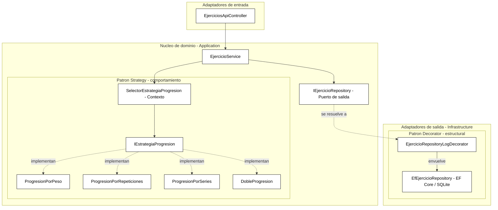

# ADR-04: Patrones de diseño GoF (Strategy y Decorator)

| Campo  | Valor |
|--------|-------|
| Autor  | Josué Enmanuel Poot Mateo |
| Fecha  | 26/06/2026 |
| Estado | `Aceptado` |

---

## Contexto

**OverLoad** registra entrenamientos de fuerza sobre una arquitectura hexagonal (ver ADR-03): un núcleo de dominio rodeado de puertos (`IEjercicioService`, `IEjercicioRepository`) y adaptadores (web MVC, API REST, persistencia EF Core/SQLite). Con la base ya funcional, surgieron dos necesidades concretas que conviene resolver con patrones de diseño en lugar de código ad hoc:

1. **Variedad de progresiones de carga.** El principio de **sobrecarga progresiva** no tiene una única fórmula: se puede progresar subiendo peso, repeticiones, series o por doble progresión. La app debe **sugerir** la próxima carga eligiendo el método en tiempo de ejecución, y se espera que el catálogo de métodos **crezca**.

2. **Observabilidad de la persistencia.** Quiero registrar (logging) cada operación contra la base de datos y su duración para diagnosticar y evidenciar el comportamiento del sistema, **sin ensuciar** el adaptador de EF Core con código de logging ni repetirlo en cada método.

Condiciones y restricciones que influyeron en la decisión:

- Proyecto académico/personal con un solo desarrollador: las soluciones deben ser simples y mantenibles.
- Ya uso **C#, Inyección de Dependencias (DI)** y la separación en puertos/adaptadores, base ideal para enchufar comportamientos intercambiables y envolventes.
- Se busca respetar el principio **Open/Closed**: poder extender el sistema (nuevas progresiones, nuevos comportamientos de persistencia) **sin modificar** el código existente.
- Requisito de la entrega: integrar **mínimo 2 patrones GoF de categorías distintas**.

---

## Decisión

Integrar **dos patrones de diseño GoF de categorías diferentes**:

| Patrón | Categoría | Problema que resuelve en OverLoad |
|--------|-----------|-----------------------------------|
| **Strategy** | Comportamiento | Encapsular cada algoritmo de progresión de carga como una clase intercambiable seleccionable en tiempo de ejecución. |
| **Decorator** | Estructural | Añadir logging a las operaciones de persistencia envolviendo el repositorio, sin modificar el adaptador de EF Core. |

### Patrón 1 — Strategy (comportamiento)

Se introduce en el núcleo (`Application/Progresion`):

- La interfaz **`IEstrategiaProgresion`** (la *estrategia*) con `Sugerir(Ejercicio) -> CargaSugerida`, más `Clave` y `Nombre`.
- Cuatro implementaciones intercambiables: **`ProgresionPorPeso`**, **`ProgresionPorRepeticiones`**, **`ProgresionPorSeries`** y **`DobleProgresion`**.
- El objeto resultado **`CargaSugerida`** (record) con la carga propuesta y su justificación.
- Un **`SelectorEstrategiaProgresion`** (el *contexto*) que recibe por DI **todas** las estrategias y resuelve la indicada por su clave.

Se expone como caso de uso `SugerirProgresionAsync(id, estrategia)` y como endpoint REST `GET /api/v1/ejercicios/{id}/sugerencia?estrategia={clave}`.

#### ¿Por qué Strategy?

Porque **define una familia de algoritmos intercambiables tras una interfaz común**, lo que permite:

- **Seleccionar el algoritmo en tiempo de ejecución** según lo que pida el usuario (`peso`, `repeticiones`, `series`, `doble`).
- **Agregar una nueva progresión sin modificar el código existente** (Open/Closed): basta crear una clase `IEstrategiaProgresion` y registrarla en DI; ni el servicio ni el selector cambian.
- Sustituir un `switch`/`if-else` gigante por **polimorfismo**, dejando cada algoritmo aislado y probable por separado.

#### Alternativas consideradas (Strategy)

| Alternativa | Por qué la descarté |
|-------------|---------------------|
| **`switch`/`if-else` dentro de `EjercicioService`** | Concentra todas las reglas en un método; cada progresión nueva obliga a editarlo y reprobarlo (rompe Open/Closed) y lo vuelve ilegible. |
| **Clases por progresión invocadas directo desde el controlador** | Acopla el adaptador de entrada a los algoritmos concretos y duplica la selección en cada canal (MVC y REST), sacando reglas del núcleo. |
| **Herencia: subclases de `Ejercicio` por tipo de progresión** | La progresión es un comportamiento que se elige por sesión, no una propiedad fija de la entidad; con herencia se rigidiza el dominio. |
| **Motor de reglas / configuración externa** | Sobredimensionado para cuatro algoritmos simples; agrega infraestructura sin beneficio real a esta escala. |

### Patrón 2 — Decorator (estructural)

Se introduce en infraestructura (`Infrastructure/Persistence`):

- **`EjercicioRepositoryLogDecorator`** implementa el mismo puerto **`IEjercicioRepository`** y recibe en su constructor **otro** `IEjercicioRepository` (el componente decorado).
- Cada método delega en el repositorio envuelto y le añade logging de inicio, fin, duración y errores.
- En DI, el puerto `IEjercicioRepository` se resuelve al decorador, que envuelve al `EfEjercicioRepository` real.

#### ¿Por qué Decorator?

Porque **agrega responsabilidades a un objeto envolviéndolo, sin alterar su clase ni a sus consumidores**, lo que permite:

- Sumar el logging **sin tocar** `EfEjercicioRepository` (Open/Closed): el adaptador de EF Core sigue haciendo solo persistencia.
- Mantener **transparencia total**: como el decorador implementa `IEjercicioRepository`, el `EjercicioService` no se entera y sigue dependiendo solo del puerto.
- **Activar o quitar** el comportamiento por configuración (DI), e incluso **apilar** más decoradores en el futuro (caché, validación, reintentos) sin cambios en el resto del sistema.

#### Alternativas consideradas (Decorator)

| Alternativa | Por qué la descarté |
|-------------|---------------------|
| **Meter el logging dentro de `EfEjercicioRepository`** | Mezcla dos responsabilidades (persistir + registrar) en una clase, rompe Single Responsibility y obliga a repetir el patrón de logging en cada método. |
| **Herencia: una subclase de `EfEjercicioRepository` con logging** | Acopla el logging a esa implementación concreta; si mañana cambio a un adaptador de archivos JSON, pierdo el comportamiento y debo reescribirlo. |
| **Middleware/filtro global de ASP.NET** | Opera a nivel HTTP, no a nivel del puerto de persistencia; no captura las operaciones reales del repositorio ni serviría a un canal no-web (cliente móvil, tarea en segundo plano). |
| **AOP / interceptores (p. ej. Castle DynamicProxy)** | Resuelve lo mismo pero agrega una dependencia y "magia" en tiempo de ejecución innecesaria para un solo decorador explícito y legible. |

---

## Consecuencias

### Lo que gano

- **Técnica:** El sistema queda abierto a extensión en dos frentes sin tocar lo existente: agregar una progresión es crear una clase `IEstrategiaProgresion`; agregar un comportamiento de persistencia (caché, validación) es crear otro decorador. Ambas reglas viven detrás de los puertos ya definidos en el ADR-03, así que se reutilizan desde cualquier adaptador (web/API/móvil).
- **Proceso/equipo:** Cada algoritmo y cada decorador es una unidad pequeña y autocontenida, fácil de revisar, documentar y probar de forma aislada. Además el logging del decorador da **evidencia visible** del funcionamiento del sistema, útil para depurar y para demostrar el avance.

### Lo que sacrifico o asumo

- **Limitación técnica:** Ambos patrones agregan más archivos e indirección (interfaces, contexto, envoltura). Para un único algoritmo o sin necesidad de logging serían innecesarios; el costo se justifica por la variedad esperada y la separación de responsabilidades.
- **Deuda o riesgo:** La estrategia se selecciona por una **clave de texto** que habrá que validar y, si crece, tipar (enum) o versionar para no romper a los clientes de la API. Y el cableado del Decorator en DI es **manual**: si se suman más decoradores habrá que ordenar bien la cadena de envoltura (o introducir un helper) para no equivocar el orden.

---

## Diagrama

Estructura de ambos patrones dentro de la arquitectura hexagonal:

