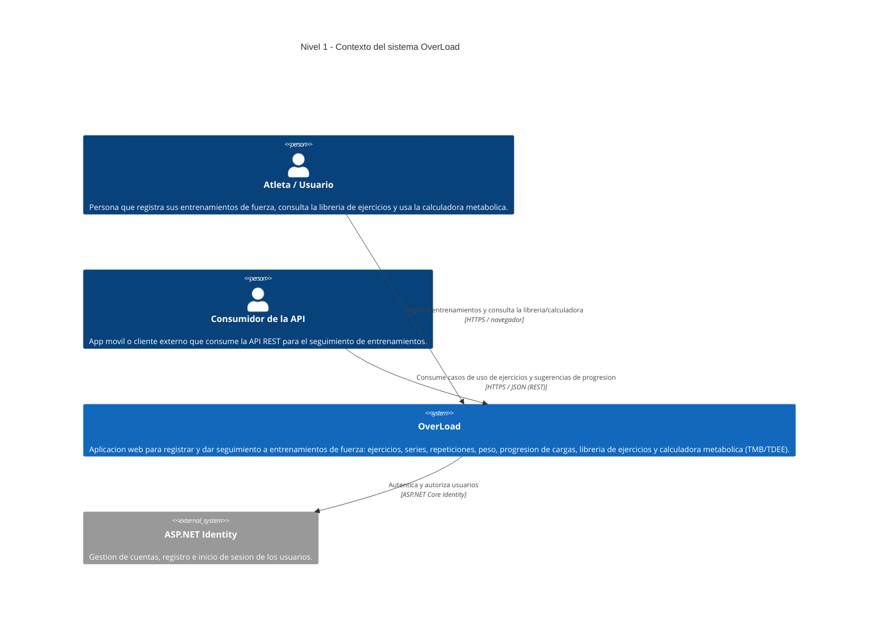

# Modelo C4 — OverLoad

Documentación de la arquitectura de **OverLoad** (app de seguimiento de entrenamientos de fuerza)
siguiendo el [Modelo C4](https://c4model.com/) de Simon Brown. Los diagramas están escritos como
código **Mermaid** para que vivan versionados junto al código fuente y evolucionen con él.

| Campo  | Valor |
|--------|-------|
| Autor  | Josué Enmanuel Poot Mateo |
| Proyecto | OverLoad |
| Niveles | 1. Contexto · 2. Contenedores · 3. Componentes |
| Notación | Mermaid (C4) |

> Cada nivel hace **zoom** sobre el anterior: del sistema completo (Nivel 1), a sus piezas
> técnicas desplegables (Nivel 2), al interior de la pieza principal (Nivel 3).

---

## C4 Nivel 1 — Diagrama de Contexto

**¿Para quién es?** Cualquier persona (usuarios, docentes, evaluadores) que quiera entender
**qué es OverLoad y quién lo usa**, sin detalle técnico.

**¿Qué pregunta responde?** *¿Quién interactúa con el sistema y con qué sistemas externos se relaciona?*

**Notas del nivel**
- El **Atleta** es el usuario principal: usa la interfaz web (MVC + Razor).
- El **Consumidor de la API** representa un canal alternativo (ej. app móvil) previsto por la
  arquitectura hexagonal; consume la misma lógica de negocio vía REST.
- **ASP.NET Identity** se modela como sistema externo porque provee autenticación lista para usar,
  fuera del dominio propio de OverLoad.
