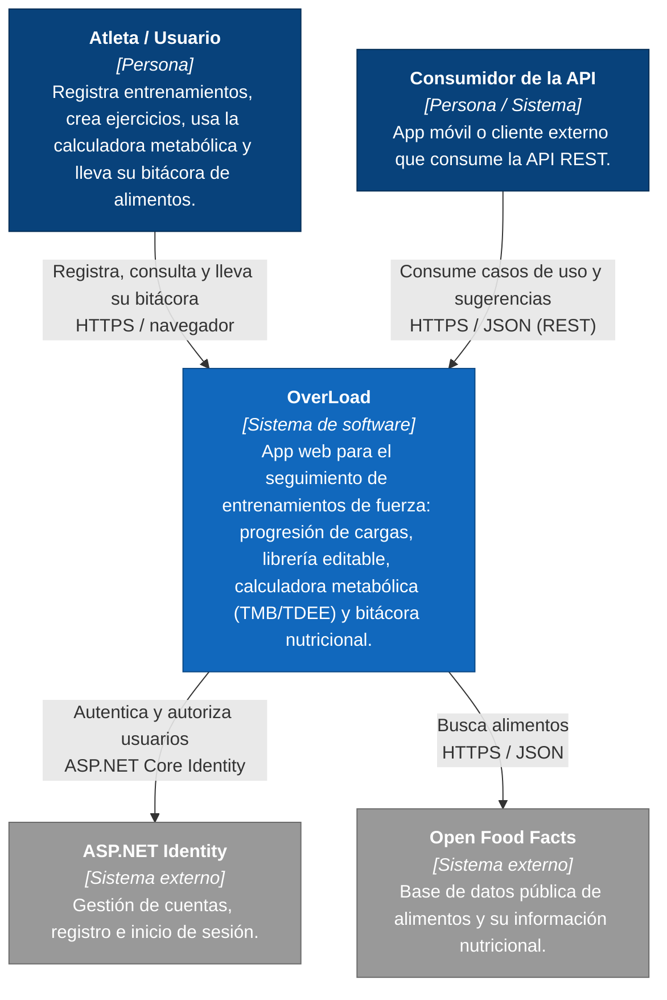
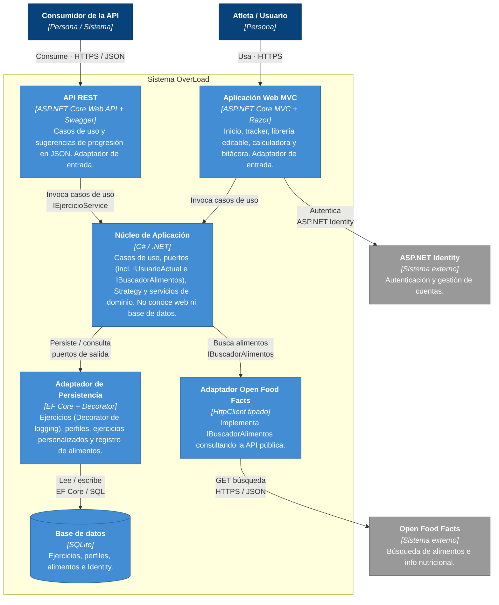

# Modelo C4 — OverLoad

Documentación de la arquitectura de **OverLoad** (app de seguimiento de entrenamientos de fuerza)
siguiendo el [Modelo C4](https://c4model.com/) de Simon Brown. Los diagramas están escritos como
código **Mermaid** para que vivan versionados junto al código fuente y evolucionen con él.

| Campo  | Valor |
|--------|-------|
| Autor  | Josué Enmanuel Poot Mateo |
| Proyecto | OverLoad |
| Niveles | 1. Contexto · 2. Contenedores · 3. Componentes |
| Notación | Mermaid (C4) |

> Cada nivel hace **zoom** sobre el anterior: del sistema completo (Nivel 1), a sus piezas
> técnicas desplegables (Nivel 2), al interior de la pieza principal (Nivel 3).

---

## C4 Nivel 1 — Diagrama de Contexto

**¿Para quién es?** Cualquier persona (usuarios, docentes, evaluadores) que quiera entender
**qué es OverLoad y quién lo usa**, sin detalle técnico.

**¿Qué pregunta responde?** *¿Quién interactúa con el sistema y con qué sistemas externos se relaciona?*

**Notas del nivel**
- El **Atleta** es el usuario principal: usa la interfaz web (MVC + Razor). Con sesión iniciada, sus
  datos (tracker, librería, perfil y bitácora) son personales.
- El **Consumidor de la API** representa un canal alternativo (ej. app móvil) previsto por la
  arquitectura hexagonal; consume la misma lógica de negocio vía REST.
- **ASP.NET Identity** y **Open Food Facts** son sistemas externos: el primero provee la
  autenticación; el segundo, la información nutricional de los alimentos que se registran en la Bitácora.

---

## C4 Nivel 2 — Diagrama de Contenedores

**¿Para quién es?** Desarrolladores y evaluadores técnicos que quieren ver **las piezas grandes
desplegables** del sistema y cómo se comunican.

**¿Qué pregunta responde?** *¿De qué bloques técnicos se compone OverLoad y qué tecnología usa cada uno?*

**Notas del nivel**
- **Web MVC** y **API REST** son dos adaptadores de entrada distintos que reutilizan el **mismo
  núcleo** — el beneficio clave de la arquitectura hexagonal. La Web MVC concentra las pantallas
  (tracker, librería, calculadora y bitácora); la API opera sobre el conjunto global de ejercicios.
- El **Núcleo** define los puertos pero no depende de EF Core, ASP.NET ni de Open Food Facts; los
  adaptadores se enchufan por inyección de dependencias.
- El **Adaptador de Persistencia** incluye el `EfEjercicioRepository` envuelto por el
  `EjercicioRepositoryLogDecorator` (Decorator) y los repositorios de perfiles, ejercicios
  personalizados y alimentos.
- El **Adaptador Open Food Facts** aísla la dependencia externa detrás del puerto `IBuscadorAlimentos`.

---

## C4 Nivel 3 — Diagrama de Componentes

**¿Para quién es?** Desarrolladores que van a **modificar o extender el código** y necesitan saber
qué clases viven dentro de la pieza principal y cómo colaboran.

**¿Qué pregunta responde?** *¿Qué controladores, servicios y patrones GoF componen el núcleo de
OverLoad y cómo se conectan a través de los puertos?*

Se hace zoom sobre los adaptadores de entrada (controladores) y el **Núcleo de Aplicación**, hasta
el adaptador de salida y la base de datos.

```mermaid
flowchart TB
    atleta["<b>Atleta / Usuario</b><br/><i>[Persona]</i>"]
    clienteApi["<b>Consumidor de la API</b><br/><i>[Persona / Sistema]</i>"]

    subgraph entrada["Adaptadores de entrada (driving)"]
        homeCtrl["<b>HomeController</b><br/><i>[MVC]</i><br/>Tracker (CRUD) + recordatorio."]
        libCtrl["<b>LibreriaController</b><br/><i>[MVC]</i><br/>Alta de ejercicios propios."]
        calcCtrl["<b>CalculadoraController</b><br/><i>[MVC]</i><br/>TMB/TDEE y macros."]
        bitCtrl["<b>BitacoraController</b><br/><i>[MVC]</i><br/>Registro diario de alimentos."]
        apiCtrl["<b>EjerciciosApiController</b><br/><i>[Web API]</i><br/>/api/v1/ejercicios."]
    end

    subgraph nucleo["Núcleo de Aplicación (hexágono)"]
        iservice["<b>IEjercicioService</b><br/><i>[Puerto entrada]</i>"]
        service["<b>EjercicioService</b><br/><i>[Servicio de aplicación]</i>"]
        selector["<b>SelectorEstrategiaProgresion</b><br/><i>[Strategy · contexto]</i>"]
        strategies["<b>IEstrategiaProgresion + 4 estrategias</b><br/><i>[Strategy · comportamiento]</i>"]
        politica["<b>PoliticaProgresion</b><br/><i>[Regla de dominio · 14 días]</i>"]
        libService["<b>LibreriaService</b><br/><i>[Servicio de aplicación]</i>"]
        catalogo["<b>CatalogoEjercicios</b><br/><i>[Servicio de dominio]</i>"]
        calc["<b>CalculadoraMetabolica</b><br/><i>[Servicio de dominio]</i>"]
        usuarioPort["<b>IUsuarioActual</b><br/><i>[Puerto]</i>"]
        buscadorPort["<b>IBuscadorAlimentos</b><br/><i>[Puerto salida]</i>"]
        irepo["<b>IEjercicioRepository</b><br/><i>[Puerto salida]</i>"]
        perfilPort["<b>IPerfilMetabolicoRepository</b><br/><i>[Puerto salida]</i>"]
        persoPort["<b>IEjercicioPersonalizadoRepository</b><br/><i>[Puerto salida]</i>"]
        alimPort["<b>IRegistroAlimentoRepository</b><br/><i>[Puerto salida]</i>"]
    end

    subgraph salida["Adaptadores de salida (driven)"]
        decorator["<b>EjercicioRepositoryLogDecorator</b><br/><i>[Decorator · estructural]</i>"]
        efrepo["<b>EfEjercicioRepository</b><br/><i>[EF Core]</i>"]
        efPerfil["<b>EfPerfilMetabolicoRepository</b><br/><i>[EF Core]</i>"]
        efPerso["<b>EfEjercicioPersonalizadoRepository</b><br/><i>[EF Core]</i>"]
        efAlim["<b>EfRegistroAlimentoRepository</b><br/><i>[EF Core]</i>"]
        offClient["<b>OpenFoodFactsClient</b><br/><i>[HttpClient tipado]</i>"]
        usuarioAdapter["<b>UsuarioActual</b><br/><i>[HttpContext]</i>"]
    end

    db[("<b>SQLite</b>")]
    off["<b>Open Food Facts</b><br/><i>[Sistema externo]</i>"]

    atleta --> homeCtrl
    atleta --> libCtrl
    atleta --> calcCtrl
    atleta --> bitCtrl
    clienteApi --> apiCtrl

    homeCtrl --> iservice
    homeCtrl -.->|"recordatorio"| politica
    apiCtrl --> iservice
    libCtrl --> libService
    homeCtrl -->|"listar librería"| libService
    calcCtrl --> calc
    calcCtrl -->|"guarda perfil"| perfilPort
    bitCtrl --> alimPort
    bitCtrl -->|"objetivo"| perfilPort
    bitCtrl -->|"buscar"| buscadorPort

    iservice -.->|"implementado por"| service
    service --> selector
    selector --> strategies
    service --> irepo
    libService --> catalogo
    libService --> persoPort
    libService --> usuarioPort

    irepo -.->|"DI"| decorator
    decorator -->|"envuelve"| efrepo
    efrepo --> db
    perfilPort -.-> efPerfil --> db
    persoPort -.-> efPerso --> db
    alimPort -.-> efAlim --> db
    usuarioPort -.-> usuarioAdapter
    buscadorPort -.-> offClient -->|"HTTPS / JSON"| off

    classDef persona fill:#08427b,stroke:#052e56,color:#ffffff;
    classDef componente fill:#85bbf0,stroke:#5d82a8,color:#000000;
    classDef datos fill:#438dd5,stroke:#2e6295,color:#ffffff;
    classDef externo fill:#999999,stroke:#6b6b6b,color:#ffffff;
    class atleta,clienteApi persona
    class homeCtrl,libCtrl,calcCtrl,bitCtrl,apiCtrl,iservice,service,selector,strategies,politica,libService,catalogo,calc,usuarioPort,buscadorPort,irepo,perfilPort,persoPort,alimPort,decorator,efrepo,efPerfil,efPerso,efAlim,offClient,usuarioAdapter componente
    class db datos
    class off externo
```

**Notas del nivel**
- **Patrón Strategy (comportamiento):** `SelectorEstrategiaProgresion` + las cuatro
  `IEstrategiaProgresion` encapsulan algoritmos intercambiables de progresión.
- **Patrón Decorator (estructural):** `EjercicioRepositoryLogDecorator` envuelve a
  `EfEjercicioRepository`; el núcleo solo ve el puerto `IEjercicioRepository`.
- **Puentes entre módulos:** `CalculadoraController` guarda el perfil (`IPerfilMetabolicoRepository`)
  que luego lee `BitacoraController` para fijar la meta diaria; `PoliticaProgresion` centraliza la
  regla del recordatorio de sobrecarga (14 días).
- **Dependencias externas tras puertos:** `IBuscadorAlimentos` (→ `OpenFoodFactsClient`) e
  `IUsuarioActual` (→ `UsuarioActual`/HttpContext) mantienen el núcleo desacoplado de Open Food Facts
  y de ASP.NET (ver ADR-03, ADR-04 y ADR-05).

---

## Declaración de uso de IA

Para elaborar esta documentación C4 se utilizó una herramienta de inteligencia artificial
(**Claude**, asistente de código) con el siguiente alcance:

- **Qué se usó:** apoyo para **redactar y estructurar** los tres diagramas C4 en sintaxis Mermaid y
  las notas explicativas de cada nivel, a partir de la inspección del código real del repositorio
  (controladores, puertos, servicios y patrones ya implementados).
- **Qué NO hizo la IA:** no diseñó ni modificó la arquitectura del sistema. La arquitectura
  hexagonal, los patrones GoF (Strategy y Decorator) y las decisiones técnicas ya existían en el
  proyecto y están documentadas en los ADR-01 a ADR-05.
- **Verificación:** el autor revisó que cada componente, contenedor y relación de los diagramas
  correspondiera con el código fuente y las decisiones previas del proyecto.
- **Responsabilidad:** el contenido final, su exactitud y la entrega son responsabilidad del autor,
  **Josué Enmanuel Poot Mateo**.
